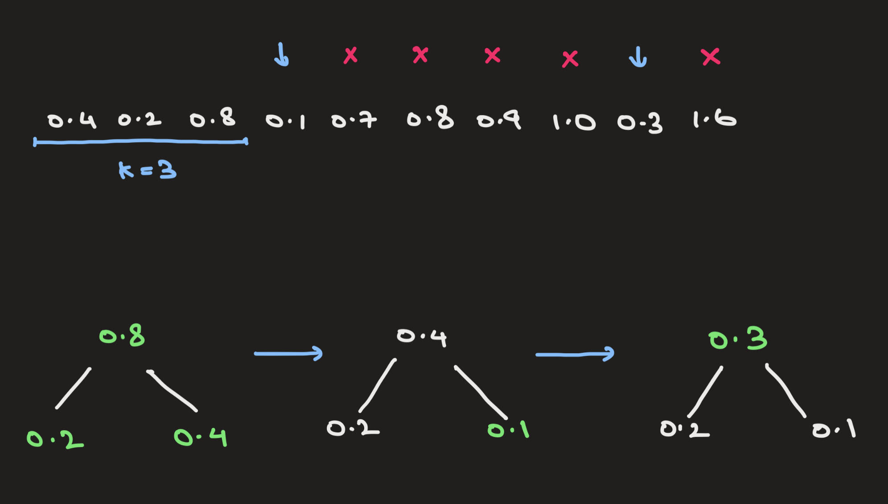

# Tutorial 1 Week 3: k-Nearest Neighbours

In T1W3, I cover the k-Nearest Neighbours (k-NN) algorithm. Find the tutorial slides [here](https://www.figma.com/file/jqyuC4tzHUu84NaXc28zPI/Tutorial-Slides?node-id=0%3A1).

## Contents
This repo contains the code used to answer Questions 2, 3, 4.

### Question 2a
Here's the ranking table used to classify the new point `(1, 1)` using 3-NN: 
```
Rank      Point     Distance       Label
1         (0, 1)    1.000          1    
2         (1, 0)    1.000          1    
3         (1, 2)    1.000          1    
4         (0, 2)    1.414          0    
5         (2, 2)    1.414          0    
6         (-1, 1)   2.000          0    
7         (1, -1)   2.000          0    
8         (2, 3)    2.236          1    

Rank      Point     Distance       Label
1         (0, 1)    1.000          1    
2         (1, 0)    1.000          1    
3         (1, 2)    1.000          1    

The new point (1, 1) belongs to class 1 using 3-NN.
```

Here's the ranking table used to classify the new point `(1, 1)` using 7-NN:
```
Rank      Point     Distance       Label
1         (0, 1)    1.000          1    
2         (1, 0)    1.000          1    
3         (1, 2)    1.000          1    
4         (0, 2)    1.414          0    
5         (2, 2)    1.414          0    
6         (-1, 1)   2.000          0    
7         (1, -1)   2.000          0    
8         (2, 3)    2.236          1    

Rank      Point     Distance       Label
1         (0, 1)    1.000          1    
2         (1, 0)    1.000          1    
3         (1, 2)    1.000          1    
4         (0, 2)    1.414          0    
5         (2, 2)    1.414          0    
6         (-1, 1)   2.000          0    
7         (1, -1)   2.000          0    

The new point (1, 1) belongs to class 0 using 7-NN.
```

### Question 2b
Larger values of `k` will lead to smoother decision boundaries. This leads to lower chances of overfitting (Covered in `T3W5`). So, the order is:

```
k_l < k_c < k_r
```

### Question 2c
Time taken to run inference on test dataset for vanilla `k-NN` is indepedent of `k`. Altogether, we'll still be taking `m * t` time given a dataset of `m` samples.

--- 

### Question 3a
Both algorithms are correct. Alice's algorithm runs in `O(n(d+k))` while that of Bob runs in `O(ndk)`. Alice's algorithm is much faster.

For implementations, check out `alice_knn.py` and `bob_knn.py`.

### Question 3b
Maintain a Balanced BST (Min/Max Heap) with `k` nodes where the BST tracks the top `k` smallest distances. This would reduce the running time to `O(n(d + logk))`. Here's how you can do it:

1. Calculate distances between all the `n` points and the new observation. This takes `O(nd)`

2. Add the first `k` distances into a Balanced BST

3. Look at the `n-k` unadded distances and iterate through them

4. If current distance is > BST root, ignore and move to the next one. This takes `O(1)`

5. If current distance is < BST root, remove root, insert current distance, and move on. This takes `O(n * logk)` for all `n` samples

6. By the end, you'll have the correct answers occupying all the `k` nodes in the BST. This takes `O(nd + nlogk)` in total

> Essentially, we are taking the first `k` distances that may be incorrect and replacing them one by one with the correct `k` distances.

<p align="center">
    
</p>    

```
if d_(k+1) < d_root:
    d_root = d_(k+1)
```

---

### Question 4
No. The difference between the two ranges give `0.4` and `10º Celcius`. This means the `Temperature` variable will dominate the k-NN when calculating the Euclidean Distance, minimising the impact or effect of the `Humidity` variable.

We can minimise the effect of this disproportion by **normalising** or **standardising** the inputs to a suitable range that won't affect the distance metric immensely. This will be covered in future classes.
